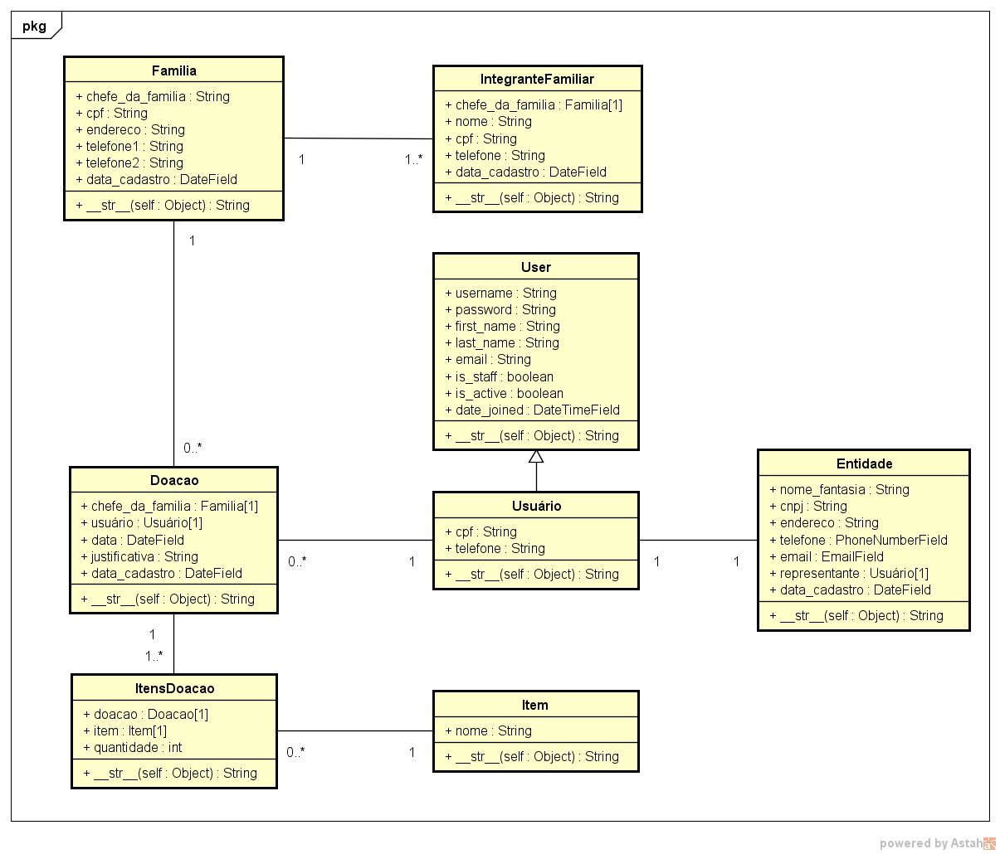

# Projeto de gestão de doações à Rede Soliedariedade

O objetivo é desenvolver um sistema web para o gerenciamento de doações para famílias carentes, realizadas pela Rede Soliedariedade.

## Diagrama do projeto

Diagrama do projeto com classes/entidades que se relacionam



## Requerimentos

- Python 3 ou superior

## Para utilizar o projeto

Utilize os códigos abaixo na linha de comando adaptando para seu sistema:

```
git clone https://github.com/Acacio-coding/Rede-Soliedariedade
```

```
cd <caminho da pasta após extrair>
```

```
python3 -m venv <nome da sua venv>
```

```
python3 -m pip install --upgrade pip
```

```
pip install -r requirements.txt
```

```
python3 manage.py collectstatic
```

```
python3 manage.py migrate
```

Obs.: Não esqueça de configurar o "<b>settings.py</b>" gerado dentro de "<b>rede_soliedariedade</b>" para atender aos seus requisitos e criar um arquivo "<b>.env</b>" para criar as variáveis de ambiente utilizadas no "<b>settings.py</b>".

## Para iniciar o servidor local

```
python3 manage.py runserver
```
